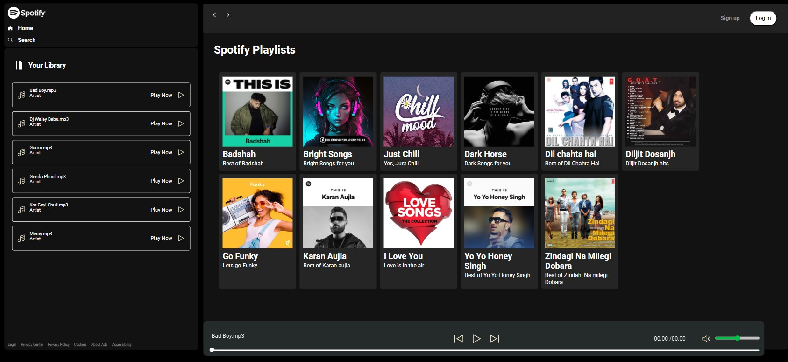
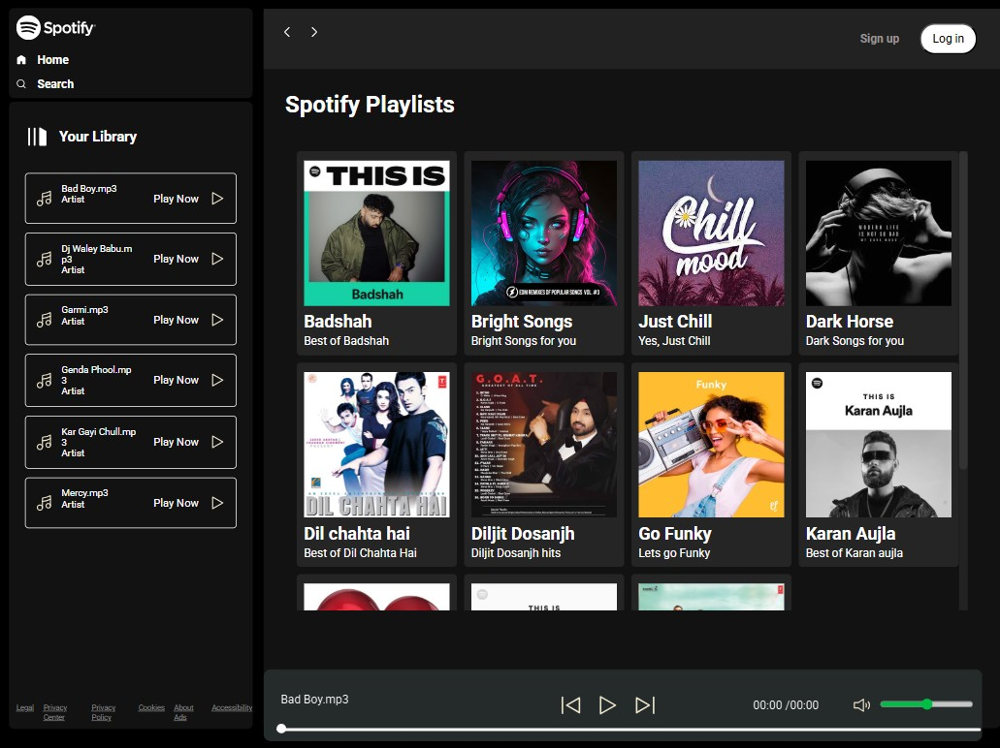
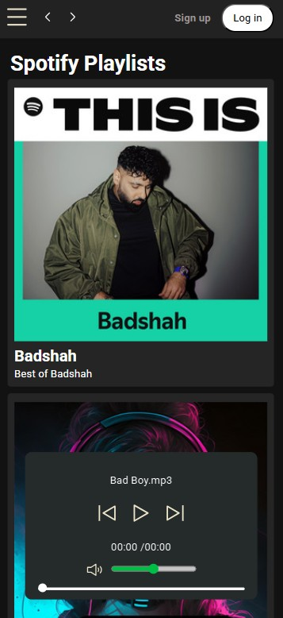

# 🎵 Spotify Clone - Music Player Web App

A sleek, responsive **Spotify-inspired music player** built using **HTML**, **CSS**, and **JavaScript**. This web app lets users browse playlists, play local MP3 files, and enjoy a modern UI that mimics the popular Spotify interface.

---

## 🔥 Features

- 🎧 Play local MP3 tracks
- 📁 Custom playlist grid with album art
- 🎵 Player controls: Play, Pause, Skip
- 📱 Responsive design for various screen sizes
- 🌙 Dark theme UI for a Spotify-like look

---

## 📸 Preview

- 💻 For Laptop/Desktop



- 📲 For Tablet



- 📱For Mobile Phone



> _Screenshot of the music player interface showing playlists and song controls._

---

## 🛠️ Built With

- **HTML5** – Semantic layout and audio player
- **CSS3** – Custom styling with Flexbox & Grid
- **JavaScript** – Dynamic interaction and song playback

---

## 🚀 How to Run Locally

1. Clone the repository:
   ```bash
   git clone https://github.com/your-username/spotify-clone.git
   ```
